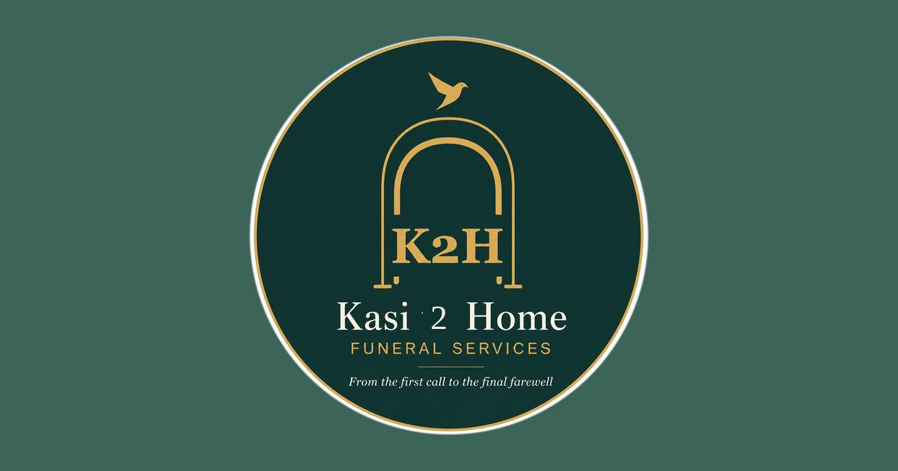

<div align="center">


# Kasi to Home Funeral Services

*From the first call to the final farewell.*

[](https://react.dev)
[](https://vitejs.dev)
[](https://tailwindcss.com)
[](https://www.typescriptlang.org)
[](https://kasitohomefunerals.co.za)
[](#)

**[kasitohomefunerals.co.za](https://kasitohomefunerals.co.za)**

---



</div>

---

## About

Kasi to Home Funeral Services is a local and national funeral services brand that helps families honour their loved ones with dignity, comfort, and affordable cover. This repository contains the full marketing website for [kasitohomefunerals.co.za](https://kasitohomefunerals.co.za) — a React SPA covering plan discovery, benefits, policy information, brochure download, and direct contact.

Cover is underwritten by **Atlehang Life (Pty) Ltd — FSP 51568**.

---

## Plans at a Glance

| Plan | Premium | Max Cover |
|------|---------|-----------|
| Excel | R167/mo | R15,000 |
| Delta | R210/mo | R20,000 |
| Classic | R291/mo | R30,000 |
| Blue *(Most Comprehensive)* | R470/mo | R50,000 |

All plans cover member + spouse + up to 6 children. Age band: member/spouse 18–65, children 0–21.

---

## Tech Stack

| Layer | Technology |
|-------|-----------|
| Framework | React 18 + TypeScript |
| Build | Vite 6 |
| Styling | Tailwind CSS v4 |
| Animation | Motion (Framer Motion) |
| UI Primitives | Radix UI |
| Icons | Lucide React |
| PDF Generation | Puppeteer + pdf-lib |
| Hosting | cPanel (`valosyst` account) |
| Deployment | cPanel Git Version Control (`.cpanel.yml`) |

---

## Project Structure

```
kasi-to-home/
├── public/                        # Static assets served at root URL
│   ├── favicon.ico
│   ├── favicon-{16,32,48,64}x*.png
│   ├── apple-touch-icon-180x180.png
│   ├── android-chrome-{192,512}x*.png
│   ├── maskable-icon-{192,512}x*.png
│   ├── og-image-1200x630.jpg      # Social sharing preview
│   ├── site.webmanifest           # PWA manifest
│   └── kasi-to-home-brochure.pdf  # Downloadable brochure
├── src/
│   ├── assets/                    # Logo & brand images (Vite-bundled)
│   │   ├── logo-circle-transparent-tight.png
│   │   ├── logo-{16..1024}x*.png
│   │   ├── atlehanglife-logo.png  # Underwriter logo
│   │   └── atlehanglife-icon.png
│   ├── app/
│   │   └── App.tsx                # Full SPA — all sections in one file
│   └── styles/
├── scripts/
│   └── generate-brochure.mjs      # Puppeteer PDF generation script
├── .cpanel.yml                    # cPanel Git deployment config
├── .htaccess                      # HTTPS redirect + SPA fallback
└── index.html                     # Entry point with SEO meta tags
```

---

## Local Development

```bash
npm install
npm run dev
```

Open [http://localhost:5173](http://localhost:5173).

---

## Build

```bash
npm run build
```

Output goes to `dist/`. This is what gets deployed to cPanel.

---

## Deployment (cPanel Git Version Control)

Deployment is automatic via `.cpanel.yml` on every push to `main`.

**One-time cPanel setup:**
1. cPanel → **Git Version Control** → **Create**
2. Clone URL: `https://github.com/valo-systems/kasi-to-home.git`
3. Repository path: `/home/valosyst/repositories/kasi-to-home`
4. Branch: `main`
5. Manage → **Pull or Deploy** → **Update from Remote**

**Deploy path:** `/home/valosyst/public_html/kasitohomefunerals.co.za`

The `.htaccess` handles HTTPS enforcement, `www` → non-www redirect, and React Router SPA fallback.

---

## Brochure

The PDF brochure is generated programmatically — not a static file. To regenerate after any content, logo, or email changes:

```bash
node scripts/generate-brochure.mjs
```

Output: `public/kasi-to-home-brochure.pdf` (3 pages — Cover · Plans · Benefits & Contact).
Commit and push to deploy the updated brochure.

---

## SEO

| Element | Detail |
|---------|--------|
| Canonical | `https://kasitohomefunerals.co.za/` |
| Robots | `index, follow` |
| Structured data | `LocalBusiness` JSON-LD |
| Open Graph | Full tags — title, description, image, url, locale `en_ZA` |
| Twitter Card | `summary_large_image` |
| PWA | Installable manifest with maskable icons |

---

## Contact

| | |
|--|--|
| **Owner** | Sibusiso Moolar |
| **Phone** | +27 76 232 7358 |
| **Business Line** | +27 78 261 3861 |
| **Email** | sibusiso.moolar@kasitohomefunerals.co.za |
| **WhatsApp** | [wa.me/27782613861](https://wa.me/27782613861) |
| **Company Reg.** | 2026/254458/07 |

---

<div align="center">


*Underwritten by Atlehang Life (Pty) Ltd — FSP 51568*

---

*Prepared by [Valo Systems](https://valosystems.co.za)*

</div>
